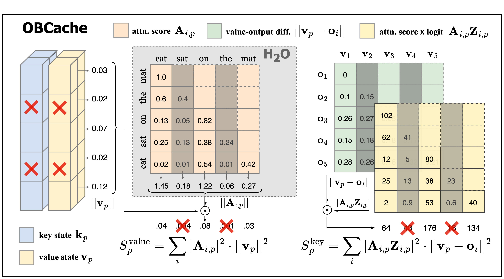

# OBCache: Optimal Brain KV Cache Pruning for Efficient Long-Context LLM Inference

Official implementation of the KV cache eviction method, introduced in the paper [OBCache: Optimal Brain KV Cache Pruning for Efficient Long-Context LLM Inference](https://arxiv.org/abs/2510.07651). Our implementation of `OBCache` builds upon the [🤗 Transformers cache utilities](https://huggingface.co/docs/transformers/en/kv_cache#generate-with-cache) and generalizes several eviction algorithms such as [H2O](https://arxiv.org/abs/2306.14048), [TOVA](https://arxiv.org/abs/2401.06104) and [SnapKV](https://arxiv.org/abs/2404.14469).



## Environment Setup
```bash
conda create -n obcache python=3.12
conda activate obcache

pip install transformers==4.47.0
pip install flash-attn==2.7.3 --no-build-isolation
```

## Inference with Cache Eviction
Below is a minimal python example showing how to inference with `OBCache` under the transformers library.
```python
from utils import load_kv_cache, load_model_and_tokenizer
from monkey_patch.utils import enable_optimal_brain_kv

model_name = "meta-llama/Llama-3.1-8B-Instruct"
model, tokenizer = load_model_and_tokenizer(model_name)
enable_optimal_brain_kv(model)
past_key_values = load_kv_cache(method="obcV", num_recent=16, num_heavy=48)

prompt = "YOUR PROMPT"
model_inputs = tokenizer([prompt], return_tensors="pt")
generated_ids = model.generate(**model_inputs, max_new_tokens=512, past_key_values=past_key_values)
generated_ids = [output_ids[len(input_ids):] for input_ids, output_ids in zip(model_inputs.input_ids, generated_ids)]
response = tokenizer.batch_decode(generated_ids, skip_special_tokens=True)[0]
print("generated response:\n", response)
```
For a more detailed demonstration, see `example_generate.py`.

## Evaluation

#### Needle-In-A-Haystack Passkey Retrieval
Evaluate baselines and `OBCache` on long-context passkey retrieval with:
```bash
bash scripts/eval_niah.sh
```
To evaluate on customized passkey-retrieval dataset, place your JSON files under `evaluation/needle/data` in a structure similar to the provided examples.

#### LongBench
Evaluate baselines and `OBCache` on LongBench tasks:
```bash
bash scripts/eval_longbench.sh
```

## Reference
If you find our work useful or relevant to your research, please kindly cite our paper:

```bibtex
@article{gu2025obcache,
      title={OBCache: Optimal Brain KV Cache Pruning for Efficient Long-Context LLM Inference}, 
      author={Yuzhe Gu and Xiyu Liang and Jiaojiao Zhao and Enmao Diao},
      journal={arXiv preprint arXiv:2510.07651},
      year={2025}
}
```