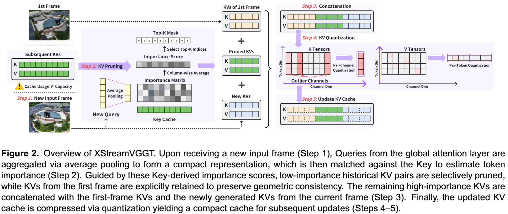

<div align="center">
<h1>XStreamVGGT: Extremely Memory-Efficient Streaming Vision Geometry Grounded Transformer with KV Cache Compression</h1>
</div>

## 🔔 News

- **[2026.01]** 🚀📄 Published as a conference paper at **SID’s Display Week 2026** !!


### [Paper](https://arxiv.org/abs/2601.01204) | [Code](https://github.com/your-repo/XStreamVGGT)

> **XStreamVGGT: Extremely Memory-Efficient Streaming Vision Geometry Grounded Transformer with KV Cache Compression**

> **Zunhai Su**<sup>\*</sup>, **Weihao Ye**<sup>\*</sup>, Hansen Feng, Keyu Fan, Jing Zhang,
> Dahai Yu, Zhengwu Liu, Ngai Wong
>
> <sup>*</sup> Equal contribution.

---

## Overview

We propose **XStreamVGGT**, a **tuning-free and extremely memory-efficient streaming vision geometry transformer** that compresses KV cache through **joint token pruning and distribution-aware quantization**. By removing redundant tokens and quantizing remaining KV representations, XStreamVGGT achieves up to **4.42× memory reduction** and **5.48× inference speedup**, while maintaining mostly negligible performance degradation. This enables scalable and long-horizon streaming 3D reconstruction in real-world applications.

<div align="center">
  
</div>

---

## Environment Setup

We recommend using Conda to set up the environment:

```bash
conda env create -f StreamVGGT_environment.yml
conda activate streamvggt
```

---

## Model Weights

Download the pretrained StreamVGGT model weights from:

* [https://huggingface.co/lch01/StreamVGGT](https://huggingface.co/lch01/StreamVGGT)

After downloading, place the checkpoint file under:

```text
XStreamVGGT/ckpt/
```

---

## Evaluation Datasets

Please refer to the official instructions of the following repositories to prepare the evaluation datasets:

* [MonST3R](https://github.com/Junyi42/monst3r/blob/main/data/evaluation_script.md)
* [Spann3R](https://github.com/HengyiWang/spann3r/blob/main/docs/data_preprocess.md)

The supported datasets include:

* Sintel
* Bonn
* KITTI
* NYU-v2
* ScanNet
* 7Scenes
* Neural-RGBD

---

## Folder Structure

The overall folder structure should be organized as follows:

```text
XStreamVGGT
├── ckpt/
│   └── checkpoints.pth
├── config/
│   ├── ...
├── data/
│   ├── eval/
│   │   ├── 7scenes
│   │   ├── bonn
│   │   ├── kitti
│   │   ├── neural_rgbd
│   │   ├── nyu-v2
│   │   ├── scannetv2
│   │   └── sintel
│   ├── train/
│   │   ├── processed_arkitscenes
│   │   ├── ...
└── src/
    ├── ...
```

---

## Evaluation

### Standard KV Cache (Pruning Only)

To evaluate XStreamVGGT with KV cache pruning enabled:

```bash
CUDA_VISIBLE_DEVICES=0 \
KV_POOL_SIZE=16 \
KV_CACHE_SIZE=2048 \
bash eval/video_depth/run.sh
```

---

### KV Cache Pruning with Simulated Quantization

To evaluate the version with **KV cache quantization**, please switch to the corresponding branch first:

```bash
git checkout prune_and_quantize
```

Then run:

```bash
CUDA_VISIBLE_DEVICES=0 \
KV_QUANT_MODE=KCVT \
KV_POOL_SIZE=16 \
KV_CACHE_SIZE=2048 \
bash eval/video_depth/run.sh
```

---

## Acknowledgements

This codebase is built upon [StreamVGGT](https://github.com/wzzheng/StreamVGGT) and related streaming 3D reconstruction frameworks. We thank the authors for their open-source contributions.

